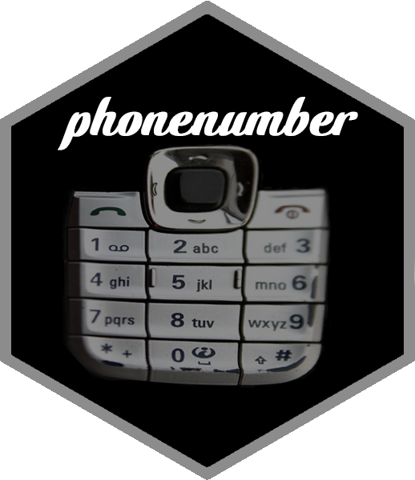

<!-- README.md is generated from README.Rmd. Please edit that file -->

# phonenumber 

<!-- badges: start -->

[](https://github.com/scumdogsteev/phonenumber/actions)[](https://cran.r-project.org/package=phonenumber)
[](https://coveralls.io/github/scumdogsteev/phonenumber?branch=master)
[](https://cran.r-project.org/package=phonenumber)
<!-- badges: end -->

### Background

When I recently posted some of my [Turbo Pascal
Stuff](https://stevemyles.site/blog/2015/06/19/turbo-pascal-stuff/), I
found an incomplete program that was supposed to do this. I was active
on [BBSes](https://en.wikipedia.org/wiki/Bulletin_board_system) and,
though I don’t recall the reason, I wanted a way to determine the
possible words spelled by the BBS phone numbers (and/or how to determine
what phone numbers correspond to words/phrases). I never got around to
finishing the second part (numbers to letters) in Turbo Pascal, though.

I decided to create this functionality in R for three reasons:

1.  to see if I could write the functions
2.  to learn to publish a package to CRAN
3.  to serve as a possible pedagogical example for others as it involves
    working with lists, splitting strings, and the
    [expand.grid](https://stat.ethz.ch/R-manual/R-devel/library/base/html/expand.grid.html)
    function.

#### Telephone keypad

For purposes of this package, the mapping of numbers to letters on a
telephone’s keypad are as follows:

-   *Default behavior* - if parameter `qz` is omitted (or has a value
    other than 0):
    -   2 corresponds to A, B, C
    -   3 corresponds to D, E, F
    -   4 corresponds to G, H, I
    -   5 corresponds to J, K, L
    -   6 corresponds to M, N, O
    -   7 corresponds to P, Q, R, S
    -   8 corresponds to T, U, V
    -   9 corresponds to W, X, Y, Z
    -   0 and 1 have no corresponding letters
-   *Alternate behavior* - if parameter `qz` = 0:
    -   2 corresponds to A, B, C
    -   3 corresponds to D, E, F
    -   4 corresponds to G, H, I
    -   5 corresponds to J, K, L
    -   6 corresponds to M, N, O
    -   7 corresponds to P, R, S
    -   8 corresponds to T, U, V
    -   9 corresponds to W, X, Y
    -   0 corresponds to Q, Z
    -   1 has no corresponding letters

### Installation

-   `phonenumber` is available [on
    CRAN](https://cran.r-project.org/package=phonenumber) and can be
    installed accordingly:

``` r
install.packages("phonenumber")
library(phonenumber)
```

-   You can also install `phonenumber` from GitHub using the `devtools`
    package:

``` r
install.packages("devtools")
library(devtools)
install_github("scumdogsteev/phonenumber")
library(phonenumber)
```

### Usage

The package consists of two functions:

1.  `letterToNumber` - converts letters in a string to numbers
2.  `numberToLetter` - converts numbers in a string to letters

Both functions convert non-alphanumeric characters to dash (-) and
perform no conversion on their respective base character type (i.e.,
`letterToNumber` leaves letters as is and `numberToLetter` leaves
numbers as is).

### Examples

**`letterToNumber`** converts a string containing letters into the
corresponding numbers on a telephone’s keypad. For example, if the user
wants to know what telephone number corresponds to “Texas:”

``` r
string <- "Texas"
letterToNumber(string)
#> [1] "83927"
```

**`numberToLetter`** converts a string containing numbers into the
corresponding letters on a telephone’s keypad. For example, if the user
wants to know what possible character strings could be spelled by a
sequence of numbers (e.g., 22):

``` r
string <- "22"
numberToLetter(string)
#> [1] "AA" "AB" "AC" "BA" "BB" "BC" "CA" "CB" "CC"
```
